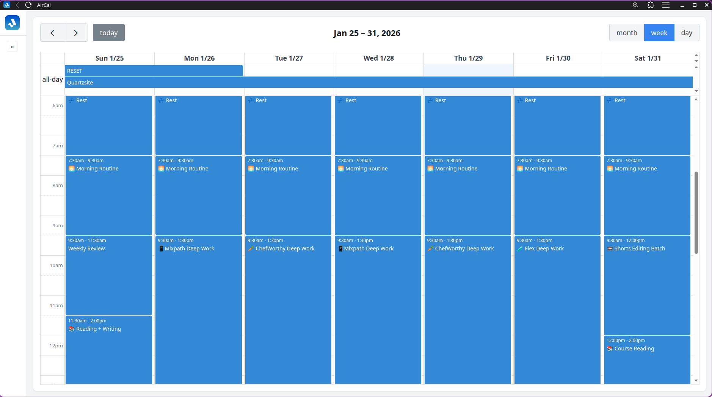
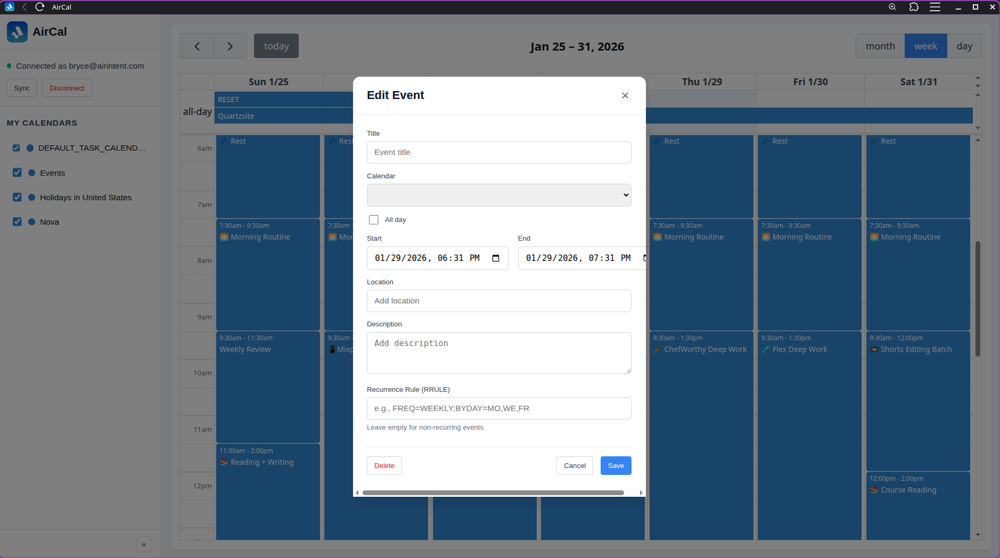

# AirCal

A self-hosted calendar application with Fastmail CalDAV integration. View and manage your calendars with a clean, modern interface featuring multiple views including calendar, timeline, map, and analytics dashboard.



## Features

### Core Calendar
- **Fastmail CalDAV Sync** - Connect to your Fastmail account and sync all your calendars
- **Multiple Views** - Month, week, and day views powered by FullCalendar
- **Multiple Calendars** - View and toggle visibility of multiple calendars
- **Recurring Events** - Full support for recurring events with RRULE expansion
- **Event Management** - Create, edit, and delete events with two-way sync
- **Local Caching** - SQLite database for fast offline access
- **Dark Mode** - Toggle between light and dark themes

### Dashboard & Analytics
- **Event Statistics** - View event counts, time spent, and patterns
- **Event Covers** - Auto-generated cover images based on event keywords and emojis
- **Visual Analytics** - See how you spend your time across calendars

### Timeline View
- **Location-Based Navigation** - Browse events grouped by location
- **Location Inheritance** - Events inherit location from previous days until a new location appears
- **Dynamic Cover Images** - Background changes based on most-attended events
- **Hover Preview** - Hover over events to preview their cover image
- **Time Aggregation** - See total time spent at each location

### Map View
- **Geographic Visualization** - See all your events on an interactive map
- **Location Clustering** - Events grouped by location with counts
- **Date Range Filtering** - Filter by day, month, or year

### Booking Links
- **Availability Management** - Set your available times for meetings
- **Booking Types** - Create different meeting types with custom durations
- **Shareable Links** - Generate booking links for others to schedule with you

## Screenshots

### Week View


### Day View


## Tech Stack

**Frontend:**
- React + TypeScript
- Vite
- FullCalendar
- TanStack Query
- React Hook Form + Zod

**Backend:**
- Python + FastAPI
- CalDAV library for Fastmail integration
- SQLite with SQLAlchemy
- iCalendar parsing with recurring-ical-events

## Getting Started

### Prerequisites

- Python 3.12+
- Node.js 20+
- A Fastmail account with an app-specific password

### Backend Setup

```bash
cd backend

# Create virtual environment
python -m venv .venv
source .venv/bin/activate

# Install dependencies
pip install -r requirements.txt

# Run the server
uvicorn app.main:app --reload
```

The API will be available at `http://localhost:8000`.

### Frontend Setup

```bash
cd frontend

# Install dependencies
npm install

# Run the dev server
npm run dev
```

The app will be available at `http://localhost:5173`.

### Connecting to Fastmail

1. Go to [Fastmail Settings > Privacy & Security > App Passwords](https://www.fastmail.com/settings/security/devicekeys)
2. Create a new app password for "AirCal"
3. In the AirCal app, enter your Fastmail email and the app password
4. Click Connect - your calendars will sync automatically

## Configuration

### Backend Environment Variables

Create a `.env` file in the `backend` directory:

```env
DEBUG=true
CORS_ORIGINS=["http://localhost:5173","http://127.0.0.1:5173"]
```

### Frontend Environment Variables

Create a `.env` file in the `frontend` directory:

```env
VITE_API_URL=http://localhost:8000
```

## API Endpoints

| Method | Endpoint | Description |
|--------|----------|-------------|
| POST | `/api/auth/connect` | Connect to Fastmail |
| GET | `/api/auth/status` | Check connection status |
| POST | `/api/auth/disconnect` | Disconnect from Fastmail |
| GET | `/api/calendars` | List all calendars |
| PUT | `/api/calendars/{id}` | Update calendar settings |
| GET | `/api/events` | Get events in date range |
| POST | `/api/events` | Create new event |
| PUT | `/api/events/{uid}` | Update event |
| DELETE | `/api/events/{uid}` | Delete event |
| POST | `/api/sync` | Force sync with Fastmail |
| GET | `/api/booking-types` | List booking types |
| POST | `/api/booking-types` | Create booking type |
| PUT | `/api/booking-types/{id}` | Update booking type |
| DELETE | `/api/booking-types/{id}` | Delete booking type |

## Project Structure

```
aircal/
├── backend/
│   ├── app/
│   │   ├── api/           # FastAPI routes
│   │   ├── models/        # SQLAlchemy models
│   │   ├── schemas/       # Pydantic schemas
│   │   └── services/      # Business logic
│   └── requirements.txt
├── frontend/
│   ├── src/
│   │   ├── api/           # API client
│   │   ├── components/
│   │   │   ├── Booking/   # Booking type management
│   │   │   ├── Calendar/  # Calendar views
│   │   │   ├── Dashboard/ # Analytics dashboard
│   │   │   ├── Events/    # Event modal
│   │   │   ├── Map/       # Map view
│   │   │   ├── Sidebar/   # Calendar list
│   │   │   └── Timeline/  # Timeline view
│   │   ├── contexts/      # React contexts (theme, calendar mode)
│   │   ├── hooks/         # React Query hooks
│   │   ├── types/         # TypeScript types
│   │   └── utils/         # Utilities (event covers, location spans)
│   └── package.json
└── docs/                  # Screenshots
```

## License

MIT
